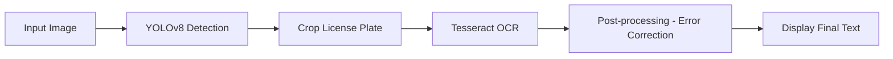
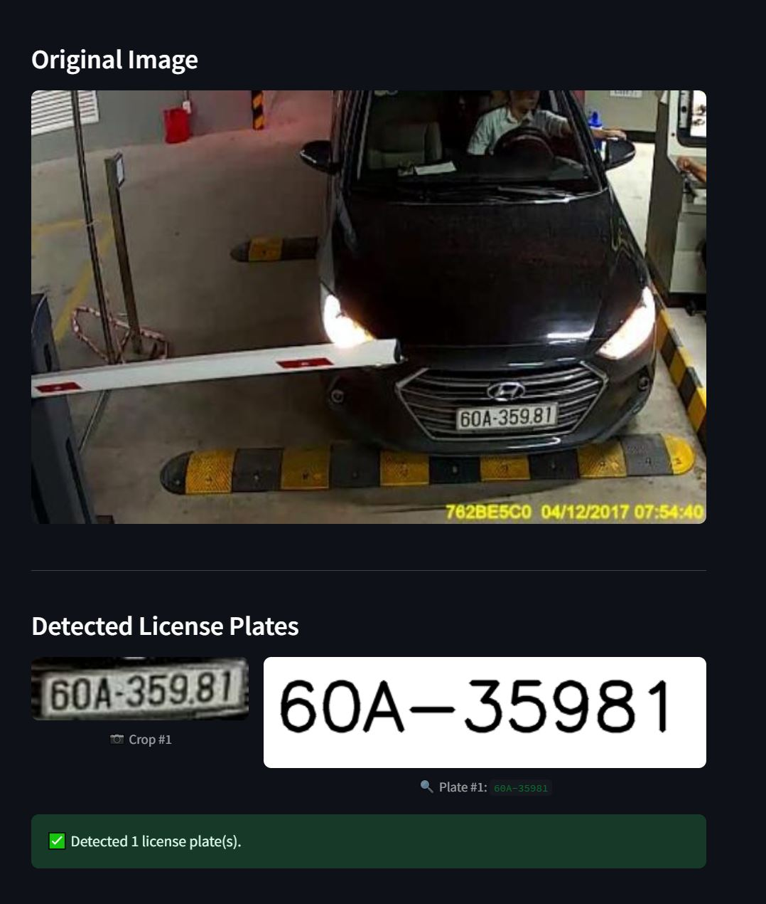

# 🚗 License Plate OCR with YOLOv8 + Tesseract

This project detects and extracts **vehicle license plate numbers** from images using a two-stage pipeline:  
🔹 **YOLOv8** for license plate detection  
🔹 **Tesseract OCR** for text recognition

<p align="center">
  
</p>

---

## 📌 Project Goals

- Detect vehicle license plates from input images.
- Apply OCR to extract the text from detected regions.
- Improve OCR accuracy with preprocessing and post-processing.
- Build a simple web interface for demonstration (using Streamlit).

---

## 🔍 System Architecture


---

## 📁 Project Structure

```
license-plate-ocr/
├── app.py                  # Streamlit web interface
├── detect_ocr.py           # Main OCR pipeline
├── requirements.txt        # Python dependencies
├── test_images/            # Sample images for testing
├── runs/                   # Trained YOLOv8 model (best.pt)
└── README.md               # This file
```

---

## 🚀 Getting Started

### 1. Install requirements

```bash
pip install -r requirements.txt
```

### 2. Launch Streamlit app

```bash
streamlit run app.py
```

---

## 🖼️ Example Results



---

## 🛠️ Tech Stack

| Component       | Tool/Library         |
| --------------- | -------------------- |
| Detection       | YOLOv8 (Ultralytics) |
| OCR             | Tesseract            |
| Post-processing | Python + Regex       |
| Web Interface   | Streamlit            |

---

## 📊 Performance

* OCR accuracy after post-processing: **\~90%+** on clear cropped plates.
* Accuracy improvements by:

  * Resizing and enhancing plate images.
  * Using grayscale or binary thresholding.
  * Post-processing to correct common OCR mistakes:
    (`O ↔ 0`, `S ↔ 5`, `I ↔ 1`, `G ↔ 6`, etc.)

---

## 💼 Real-world Applications

* Automated entry/exit systems in parking lots.
* Traffic camera plate reading.
* Vehicle tracking in smart cities.

---

## 👤 Author

* **Name**: Do Tuan Minh
* **Role**: AI student & developer of this pipeline and interface

---

## ⭐ Like this project?

If you find this helpful, consider giving it a **⭐ Star** to support the work!

.

